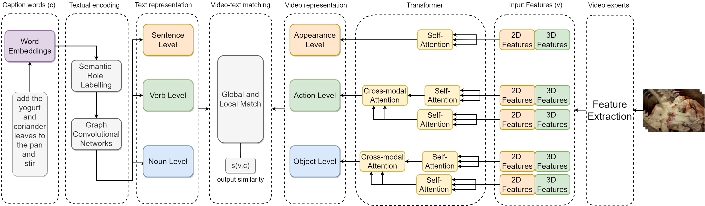
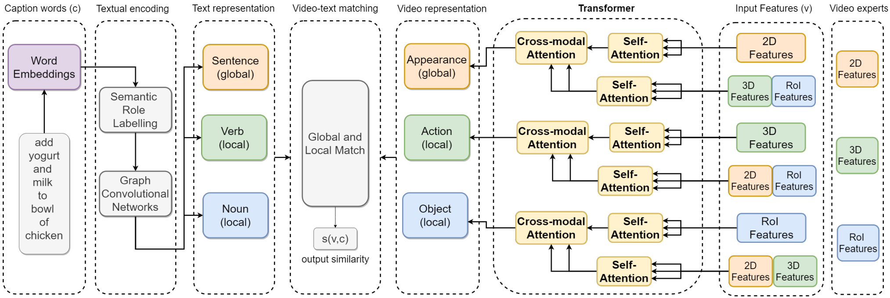
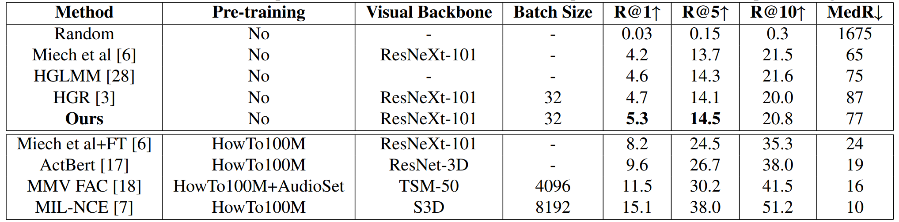
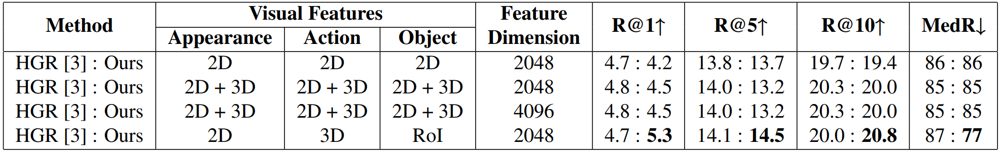

# Our Approaches for Text-to-Video Retrieval
This repo provides the pseudocode for the following works.
- RoME: Role-aware Mixture-of-Expert Transformer for Text-to-Video Retrieval, TCSVT'22 (under review)
- The method got 3rd (joint) award in CVPR'22 Epic Kitchen Multi Instanse Retrieval Challenge (coming soon)
- Semantic Role Aware Correlation Transformer for Text-to-Video Retrieval, ICIP'21

# The pseudocode

We follow [HGR](https://github.com/cshizhe/hgr_v2t) method as a baseline.
You may easily replicate our experiments by following the baseline code and our directions.
- For textual encoding, we use semantic role labeling [tool](https://demo.allennlp.org/semantic-role-labeling) from AllenNLP.
- We extract video features by following this [repo](https://github.com/antoine77340/video_feature_extractor).
- We add certain transformer encoder and decoders in the video encoding part, by using [transformers](https://pytorch.org/docs/stable/generated/torch.nn.Transformer.html) from PyTorch.
- Other parts are clearly mentioned in the papers.
- If any question you have, I would be happy to answer them or clarify the things regarding the implemention/paper.

# RoME: Role-aware Mixture-of-Expert Transformer for Text-to-Video Retrieval, TCSVT'22 (under review)

### The model



### The results on YouCook2 Validation Set for Text-to-Video Retrieval

We overpass SOTA methods in all metrics by using the same feature set when no pre-training, except the last metric compared to the last method. 

| **Method** 	| **Visual Backbone** 	| **Batch Size** 	| **R@1↑** 	| **R@5↑** 	| **R@10↑** 	| **MdR↓** 	|
|:---:	|:---:	|:---:	|:---:	|:---:	|:---:	|:---:	|
| Random 	| - 	| - 	| 0.03 	| 0.15 	| 0.3 	| 1675 	|
| UniVL (v2-FT-Joint), 2020 	| Resnet-152 (ImageNet) + <br>ResNeXt-101 (Kinetics) 	| 32 	| 3.4 	| 10.8 	| 17.8 	| 76 	|
| Satar et al., 2021 	| Resnet-152 (ImageNet) + <br>ResNeXt-101 (Kinetics) 	| 32 	| 4.5 	| 13.2 	| 20.0 	| 85 	|
| Miech et al., 2019 	| Resnet-152 (ImageNet) + <br>ResNeXt-101 (Kinetics) 	| - 	| 4.2 	| 13.7 	| 21.5 	| 65 	|
| HGR*, 2020 	| Resnet-152 (ImageNet) + <br>ResNeXt-101 (Kinetics) 	| 32 	| 4.8 	| 14.0 	| 20.3 	| 85 	|
| HGR*, 2020 	| Resnet-152 (ImageNet) + <br>ResNeXt-101 (Kinetics) + <br>Faster R-CNN (MS COCO) 	| 32 	| 4.7 	| 14.1 	| 20.0 	| 87 	|
| HGLMM, 2020 	| Fisher Vectors 	| - 	| 4.6 	| 14.3 	| 21.6 	| 75 	|
| <br>Satar et al., 2021 	| Resnet-152 (ImageNet) + <br>ResNeXt-101 (Kinetics) + <br>Faster R-CNN (MS COCO) 	| <br>32 	| <br>5.3 	| <br>14.5 	| <br>20.8 	| <br>77 	|
| SwAMP, 2021 	| Resnet-152 (ImageNet) + <br>ResNeXt-101 (Kinetics) 	| 128 	| 4.8 	| 14.5 	| 22.5 	| 57 	|
| TACo, 2021 	| Resnet-152 (ImageNet) + <br>ResNeXt-101 (Kinetics) 	| 128 	| 4.9 	| 14.7 	| 21.7 	| 63 	|
| COOT, 2020 	| Resnet-152 (ImageNet) + <br>ResNeXt-101 (Kinetics) 	| 32 	| 5.9 	| 16.7 	| 24.8 	| **49.7** 	|
| **RoME** 	| Resnet-152 (ImageNet) + <br>ResNeXt-101 (Kinetics) 	| 32 	| **6.3** 	| **16.9** 	| **25.2** 	| 53 	|

### The results on MSR-VTT Split 1k-B for Text-to-Video Retrieval

We overpass SOTA methods in all metrics when no pre-training with the same feature set on 1k-B split.

| **Method** 	| **Visual Backbone** 	| **Batch Size** 	| **R@1↑** 	| **R@5↑** 	| **R@10↑** 	| **MdR↓** 	|
|:---:	|:---:	|:---:	|:---:	|:---:	|:---:	|:---:	|
| Random 	| - 	| - 	| 0.1 	| 0.5 	| 1.0 	| 500 	|
| MoEE, 2018 	| SENet-154 (ImageNet) +<br>R(2+1)D (IG-65m) + <br>Two more visual experts 	| - 	| 13.6 	| 37.9 	| 51.0 	| 10 	|
| JPoSE, 2019 	| TSN + Flow 	| - 	| 14.3 	| 38.1 	| 53.0 	| 9 	|
| UniVL (v1*), 2020 	| Resnet-152 (ImageNet) + <br>ResNeXt-101 (Kinetics) 	| - 	| 14.6 	| 39.0 	| 52.6 	| 10 	|
| SwAMP, 2021 	| Resnet-152 (ImageNet) + <br>ResNeXt-101 (Kinetics) 	| 128 	| 15.0 	| 38.5 	| 50.3 	| 10 	|
| CE, 2019 	| SENet-154 (ImageNet) +<br>R(2+1)D (IG-65m) +<br>Six more visual experts 	| - 	| 18.2 	| 46.0 	| 60.7 	| 7 	|
| TACo, 2021 	| Resnet-152 (ImageNet) + <br>ResNeXt-101 (Kinetics) 	| 128 	| 19.2 	| 44.7 	| 57.2 	| 7 	|
| **RoME** 	| Resnet-152 (ImageNet) + <br>ResNeXt-101 (Kinetics) 	| 32 	| **21.1** 	| **50.0** 	| **63.1** 	| **5** 	|

# Technical report for the method got 3rd (joint) award in CVPR'22 Epic Kitchen Multi Instanse Retrieval Challenge

(coming soon)

# Semantic Role Aware Correlation Transformer for Text-to-Video Retrieval, ICIP'21

### The model



### The results on YouCook2 Validation Set

Text-to-video retrieval comparison with SOTA approaches on YouCook2 validation set. ’Visual Backbone’ only refers to 3D CNNs Features. Our method surpasses the SOTA methods in the first two parameters when without pre-training.



### The ablation experiments

Ablation studies on YouCook2 dataset to investigate the contributions of various feature experts at different levels. The same ablation is also done on HGR method [3] since it is a strong baseline. On 2D + 3D visual features setting, when the feature dimension is 4096, concatenation is done on dimension one; otherwise is done on dimension zero. Our model surpasses HGR with the same hierarchical features with a high margin by using cross-modal attention.



### References

If you find this any part of this repo useful, we'd really appreciate it if you could cite the following papers

[1] RoME: Role-aware Mixture-of-Expert Transformer for Text-to-Video Retrieval:

```


```

[2] Semantic Role Aware Correlation Transformer For Text To Video Retrieval:

```
@INPROCEEDINGS{9506267,
    author={Satar, Burak and Hongyuan, Zhu and Bresson, Xavier and Lim, Joo Hwee},  
    booktitle={2021 IEEE International Conference on Image Processing (ICIP)},   
    title={Semantic Role Aware Correlation Transformer For Text To Video Retrieval},   
    year={2021},  
    volume={},  
    number={},  
    pages={1334-1338},  
    doi={10.1109/ICIP42928.2021.9506267}
}
```
